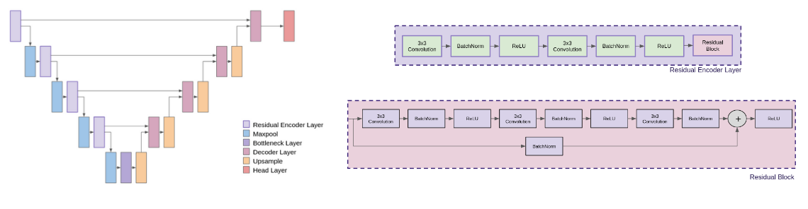
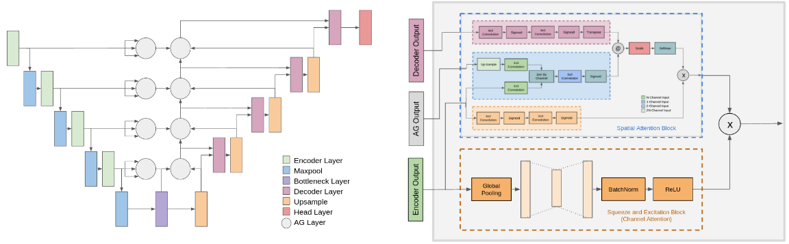
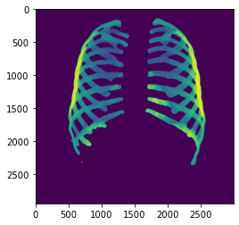

# README

Revisado el: 		26/08/2022
Última modificación: 	26/08/2022

Revisado por: Tomás de la Sotta

# Modelos Disponibles
La lista de modelos disponibles actualmente es la siguiente:

    - 'U-Net'
    - 'ThreeHeadAttentionUNet'
    - 'ResidualUNet'
    - 'SpatialAttentionUNet'
    - 'DoubleSpatialAttentionUNet'
    - 'FullSpatialAttentionUNet'
    - 'ResNetUNet50'
    - 'ResNetUNet34'
    - 'ResNetUNet18'
    - 'SpatialResNet'
    - 'SpatialTransformer' (Deprecated)
    - 'ResidualSpatialAttention'
    - 'MBSpatialAttention' (Deprecated)
    - 'SwinUNet'
    - 'SpatialDecoderUNet'
    - 'SpatialDecoderResNetUNet'
    - 'DecoderCrossAttentionUNet'
    
Los archivos de entrenamiento para cada modelo se encuentran en la sección *Preparación dl Sistema para Ejecución*.

## U-Net
Implementación del modelo *U-Net* original.


    

    


## Three Head Attention U-Net
Modelo *U-Net* con capas débilmente atencionales propuestas en *[1]* en reemplazo de las *skip layers*.


    

    


## Residual U-Net
Modelo *U-Net* con bloques residuales añadidos al encoder.


    

    


## Spatial Attention U-Net
Modelo tipo *Three Head Attention U-Net* con cabezal de atención modificado.


    

    


## Double Spatial Attention U-Net
Modelo tipo *Three Head Attention U-Net* con cabezal de atención modificado.


    

    


## Full Spatial Attention U-Net
Modelo tipo *Three Head Attention U-Net* con cabezal de atención modificado.


    

    


## ResNet U-Net 18/34/50
Modelo *U-Net* con encoder tipo *ResNet 18/34/50*. La figura muestra el modelo *ResNetUNet34*.


    

    


## Spatial ResNet
Modelo tipo *Spatial Attention U-Net* con encoder *ResNet-18*.


    

    


## Residual Spatial Attention
Modelo tipo *Spatial Attention U-Net* con bloques residuales en encoder.


    

    


## Swin U-Net
Modelo *U-Net* con encoder tipo *Swin-Transformer Base*.


    

    


## Spatial Decoder U-Net
Modelo tipo *U-Net* con capas atencionales tipo *Spatial Attention* en el decoder.


    

    


## Spatial Decoder ResNet U-Net
Modelo *ResNet U-Net* con capas atencionales tipo *Spatial Attention U-Net* en el decoder.


    

    


## Decoder Cross-Attention U-Net
Modelo tipo *U-Net* con capas atencionales tipo *Cross-Attention* en el decoder.


    

    


# Preparación del Sistema para Ejecución

El código presente en este GitHub es suficiente para realizar entrenamientos desde 0. De todas maneras, los modelos ya están entrenados y se dispone de un conjunto de datasets bien formateados para la tarea. Estos archivos se deben obtener según lo dispuesto en esta sección.

## Archivos Faltantes

Se deben incluir en la directorio base los archivos descritos en el siguiente link. Esto se debe a que estos documentos superan el peso permitido por GitHub.

    https://drive.google.com/drive/folders/1ctIix1bh6lAU_oGSTcQjX7LiiDbiK1Hm?usp=sharing
    
## Requisitos

Para tener un ambiente funcional de python, se recomienda el uso de los requisitos propuestos en el archivo requirements.txt. A continuación se muestran dos maneras de crear un ambiente con estos requisitos, aunque se puede realizar de manera manual si se desea.

### Anaconda Environment
Para crear un entorno de conda con estos requisitos, utilizar el siguiente comando:

```js
conda create --name <env> --file requirements.txt
```

### Pip Environment
Para crear un entorno de conda con estos requisitos, utilizar el siguiente comando:

```js
python3 -m venv env
source env/bin/activate
pip install -r requirements.txt
```

# Como Realizar un Entrenamiento

# Ejecutar el Segmentador

Para poder predecir una máscara, hay dos maneras de realizarlo. La primera forma corresponde a ejecutar el segmentador desde la terminal de comandos. Esto nos permite obtener la predicción para una sola imagen a la vez.
El segundo caso requiere de utilizar python, esto permite manejar mejor los recursos y ser más eficiente al momento de correr varias imágenes consecutivas.

## Como ejecutar el Segmentador para una Única Imagen

Para ejecutar el segmentador ejecutamos, desde el directorio principal de nuestro sistema, el siguiente comando en la terminal. Es importante tener el modelo en el mismo directorio del archivo *predict.py* bajo el nombre *MODEL.pth*.

```js
python3 predict.py -m {model} -i {image root} -o {output mask name}
```

Notemos que existen las siguientes opciones para la ejecución del modelo:

	--model / -m			Define el tipo de modelo a utilizar, default='U-Net'
	--input / -i			Ubicación y nombre de la imagen a utilizar
    	--output / -o 			Ubicación y nombre de la imagen de salida
	--no-save / -n			Al agregar este token la imagen no se guardará
	--mask-threshold / -t	 	Permite ajustar el threshold de la máscara de salida, default=0.5
	--scale / -s 			Permite reescalar la imagen de entrada para ahorro de memoria, default=1
	--file-path / -fp		Ubicación del dataset, default='./data/Montgomery-Shenzhen/'
	
El dataset de entrenamiento es requerido para crear las imágenes, de todas maneras, basta con que este dataset contenga solamente una imagen y los archivos correspondientes a:
	
	- train.txt
	- labels.txt
	- train_class.txt
	- train_mask.txt
	
Se recomienda descargar los archivos incluidos anteriormente.

## Como Utilizar el Segmentador en Código

Para segmentar utilizando este código debemos realizar los siguientes pasos:

### Librerías a Utilizar

Para ejecutar el segmentador en código es necesario importar ciertas librerías. Notemos que esto no es necesario en la línea de comandos.

#### Archivo a Ejecutar


```python
import predict
```

#### Librerías Adicionales

Notemos que para esta versión se utiliza Torch V1.12


```python
import torch
from PIL import Image

from utils.dataset import DefaultDataset
```

#### CUDA

Antes de cargar los modelos verificaremos si hay tarjeta gráfica disponible.


```python
device = torch.device('cuda' if torch.cuda.is_available() else 'cpu')
```

## Paso 1: Cargar el Modelo

Notemos que se trata de un conjunto de modelos, por lo que debemos cargarlo uno a uno. Más adelante se muestra como ejecutarlos en conjunto.

#### Modelo Costillas

Para este ejemplo, el modelo de costillas seleccionado corresponde a Residual U-Net.


```python
rib_model = predict.model_dict['ResidualUNet'](n_channels=1, n_classes=2)
```

Cargamos el modelo ya entrenado.


```python
rib_model.load_state_dict(torch.load('./pretrained/RIB_MODEL.pth', map_location=device))
```


    <All keys matched successfully>


#### Modelo Pulmones

Para este ejemplo, el modelo de costillas seleccionado corresponde a Spatial Attention U-Net.


```python
lung_model = predict.model_dict['SpatialAttentionUNet'](n_channels=1, n_classes=2)
```

Cargamos el modelo ya entrenado.


```python
lung_model.load_state_dict(torch.load('./pretrained/LUNG_MODEL.pth', map_location=device))
```


    <All keys matched successfully>


#### Modelo Clavículas

Para este ejemplo, el modelo de costillas seleccionado corresponde a Spatial Decoder U-Net.


```python
clavicle_model = predict.model_dict['SpatialDecoderUNet'](n_channels=1, n_classes=2)
```

Cargamos el modelo ya entrenado.


```python
clavicle_model.load_state_dict(torch.load('./pretrained/CLAVICLE_MODEL.pth', map_location=device))
```


    <All keys matched successfully>


#### Modelo Corazón

Para este ejemplo, el modelo de costillas seleccionado corresponde a Residual U-Net.


```python
heart_model = predict.model_dict['ResidualUNet'](n_channels=1, n_classes=2)
```

Cargamos el modelo ya entrenado.


```python
heart_model.load_state_dict(torch.load('./pretrained/HEART_MODEL.pth', map_location=device))
```


    <All keys matched successfully>


  

## Paso 2: Cargar Imágenes

Para este ejemplo utilizamos solamente una imagen pero no debería ser un problema extenderlo a múltiples.


```python
filename = 'Test.png'

img = Image.open(filename)
```

Para el preprocesamiento de imágenes, se debe crear un objeto dataset. Notemos que no es necesario que las imágenes a utilizar sean parte de este dataset.


```python
dataset = DefaultDataset('./dataset/')
```

 

## Paso 3: Segmentar

Utilizamos la función predict_img de predict.

#### Pulmones


```python
lung_mask = predict.predict_img(net=lung_model,
                            full_img=img,
                            dataset=dataset,
                            device=device)[1]
```

#### Corazón


```python
heart_mask = predict.predict_img(net=heart_model,
                            full_img=img,
                            dataset=dataset,
                            device=device)[1]
```

#### Clavículas


```python
clavicle_mask = predict.predict_img(net=clavicle_model,
                            full_img=img,
                            dataset=dataset,
                            device=device)[1]
```

#### Costillas


```python
rib_mask = predict.predict_img(net=rib_model,
                            full_img=img,
                            dataset=dataset,
                            device=device)[1]
```

  

## Paso 4: Visualizar

Las máscaras de salida de las imágenes son binarias, es decir, con todos sus pixeles de valor 0 o 1. De esta manera, se pueden realizar 3 tipos de visualización.

### Visualización Imagen-Máscara

Aquí tenemos una función en predict que nos ayuda a realizar esto.

#### Pulmones


```python
predict.plot_img_and_mask(img, lung_mask)
```


    

    


#### Clavículas


```python
predict.plot_img_and_mask(img, clavicle_mask)
```


    

    


#### Costillas


```python
predict.plot_img_and_mask(img, rib_mask)
```


    

    


#### Corazón


```python
predict.plot_img_and_mask(img, heart_mask)
```


    

    


 

### Visualización de Imagen Segmentada

Como la máscara es binaria, podemos multiplicar la imagen de entrada con esta.

La máscara de salida es de tipo numpy array, por lo que se puede mostrar con la herramienta de preferencia. Para este ejemplo se utilizará matplotlib.


```python
import matplotlib.pyplot as plt
```

#### Pulmones


```python
plt.imshow(img * lung_mask)
```


    <matplotlib.image.AxesImage at 0x7fc77fc3c3a0>


    

    


#### Clavículas


```python
plt.imshow(img * clavicle_mask)
```


    <matplotlib.image.AxesImage at 0x7fc77fce1670>


    

    


#### Costillas


```python
plt.imshow(img * rib_mask)
```


    <matplotlib.image.AxesImage at 0x7fc77fdaf550>


    

    


#### Corazón


```python
plt.imshow(img * heart_mask)
```


    <matplotlib.image.AxesImage at 0x7fc77fcf7160>


    

    


 

### Visualización de Sólo Máscara

La máscara de salida es de tipo numpy array, por lo que se puede mostrar con la herramienta de preferencia. Para este ejemplo se utilizará matplotlib.


```python
import matplotlib.pyplot as plt
```

#### Pulmones


```python
plt.imshow(lung_mask)
```


    <matplotlib.image.AxesImage at 0x7fc77fd3ab20>


    

    


#### Clavículas


```python
plt.imshow(clavicle_mask)
```


    <matplotlib.image.AxesImage at 0x7fc77fc063d0>


    

    


#### Costillas


```python
plt.imshow(rib_mask)
```


    <matplotlib.image.AxesImage at 0x7fc781666fd0>


    

    


#### Corazón


```python
plt.imshow(heart_mask)
```


    <matplotlib.image.AxesImage at 0x7fc77fd824f0>


    

    

# Bibliography

*[1] F. Cao and H. Zhao, “Automatic Lung Segmentation Algorithm on Chest X-ray Images Based on Fusion Variational Auto-Encoder and Three-Terminal Attention Mechanism,” Symmetry, vol. 13, no. 5, p. 814, May 2021, doi: 10.3390/sym13050814.*

